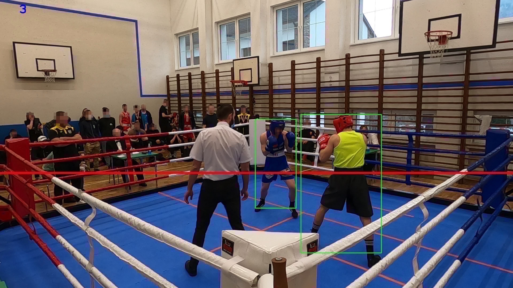
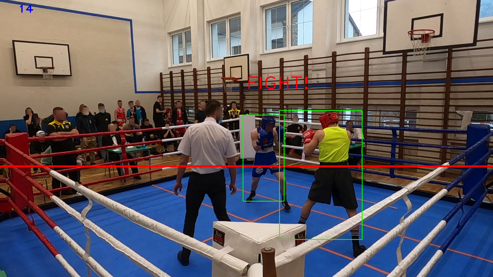

# Introduction
This repository contains the source code for experimental research conducted on the analysis of boxing fight recordings. 
The research focuses on video data, using the publicly available datasets:
1. [Olympic Boxing Punch Classification Video Dataset](https://www.kaggle.com/datasets/piotrstefaskiue/olympic-boxing-punch-classification-video-dataset) on Kaggle - labelled dataset by boxing referees for supervised learning.
2. [Olympic Boxing Video Dataset](https://www.kaggle.com/datasets/piotrstefaskiue/olympic-boxing-video-dataset-unlabeled) on Kaggle - recorded and anonymized videos of the competition.

The primary goal of this repository is to ensure the reproducibility of the experiments and findings presented in published papers by the authors.
By providing access to the code and methodologies used, this repository aims to assist researchers, data scientists, and sports analysts in replicating the results, further enhancing the study of boxing video analysis.

# Reproducing experiments
## Environment preparation
### Requirements
1. Python (tested on Python 3.12.3)
2. pip (tested on pip 23.2.1)

### Installation
1. Install dependencies `pip install -r requirements.txt`

## Detecting boxers in the boxing ring
Follow bellow instruction to obtain results published in the paper[1] like in the picture bellow

### Requirements
1. Download some video to test e.g. `kam4/GH059681.MP4` from [published dataset](https://www.kaggle.com/datasets/piotrstefaskiue/olympic-boxing-video-dataset-unlabeled) and save into `./data/videos`
2. Download pretrained weights to network (tested on ssd mobilenet v3 trained on coco dataset, files available on [Google Drive](https://drive.google.com/drive/folders/1TB3rL7pTCSQhcGYloc-jTIk1l_GvwEeE?usp=sharing)) saved into `./data/models`

To reproduce run `python detecting_boxers_in_the_boxing_ring.py`

## Detecting Clashes in Boxing
Follow bellow instruction to obtain results published in the paper[2] like in the picture bellow

### Requirements
The same as for Detecting boxers in the boxing ring

To reproduce run `python detecting_clashes_in_boxing.py`

## Punch Classification
Follow bellow instruction to obtain results published in the paper[3] like in the saved results in `punch_classification.ipynb` python notebook.

### Requirements
1. Jupyter server

To reproduce use `punch_classification.ipynb` python notebook and run all cells in it.

## Punch Detecting
### Requirements
1. Download dataset from [published dataset](https://www.kaggle.com/datasets/piotrstefaskiue/olympic-boxing-punch-classification-video-dataset), extract and save directories (e.g. `task_kam2_gh078416`) into `./data/annotated_videos`
2. Jupyter server

To reproduce:
1. Extract frames from labeled videos by running `python preprocess_frames_before_classification.py` - called `Approach 1` in the paper [4]
2. To reproduce use `punch_detection.ipynb` python notebook and run all cells in it.

## Improve Punch Detecting by video frame segmentation
To reproduce:
1. Extract frames with proposed approaches by running:
   1. `python preprocess_frames_before_classification.py --approach=extract_colours` - called `Approach 2` in the paper [4]
   2. `python preprocess_frames_before_classification.py --approach=background_subtraction_by_mog2` - called `Approach 3` in the paper [4]
   3. `python preprocess_frames_before_classification.py --approach=hybrid_extraction` - called `Approach 4` in the paper [4]
2. Train and evaluate classifiers on each segmentation approach using `punch_detection.ipynb` python notebook.

### Own segmentation approach that reduces processing time
To reproduce extract frames with proposed algorithm in the paper [5], by running:

1. `python preprocess_frames_before_classification.py --approach=speed_movement_extraction --compare_with_n_back_frame=13` where `compare_with_n_back_frame` parameter is tunable. The author published the results for following set of n: `{1,2,3,5,8,13,21,34,55}` in the paper [5].
2. Train and evaluate classificator on the proposed segmentation approach using `punch_detection.ipynb` python notebook.

# References
1. Stefański, P., Kozak, J., & Jach, T. (2022, November). The problem of detecting boxers in the boxing ring. In Asian Conference on Intelligent Information and Database Systems (pp. 592-603). Singapore: Springer Nature Singapore.
2. Stefanski, P. (2022, April). Detecting clashes in boxing. In Proceedings of the 3rd Polish Conference on Artificial Intelligence, Gdynia, Poland (pp. 25-27).
3. Stefański, P., Jach, T., & Kozak, J. (2023, September). Classification of Punches in Olympic Boxing Using Static RGB Cameras. In International Conference on Computational Collective Intelligence (pp. 540-551). Cham: Springer Nature Switzerland.
4. Stefański, P., Kozak, J., & Jach, T. (2024). Boxing Punch Detection with Single Static Camera. Entropy, 26(8).
5. Stefański, P., & Jach, T. (2024, August). Improved CNN Model Stability and Robustness with Video Frame Segmentation. In International Conference on Computational Collective Intelligence (pp. 157-169). Cham: Springer Nature Switzerland.